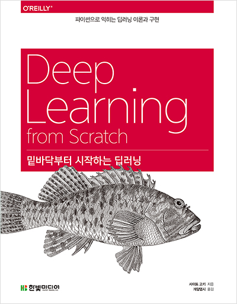

# 『밑바닥부터 시작하는 딥러닝』 스터디

- 스터디 시작 : 2021. 12. 26
- 스터디 목적 : 딥러닝 기초 다지기

</img> 

## 목차

| 챕터 | 이름                                   |   시작일   |   종료일   |
| :--: | :------------------------------------- | :--------: | :--------: |
|  1   | [헬로파이썬]()                         | 2021.12.27 | 2022.01.02 |
|  2   | [퍼셉트론]()                           | 2021.12.27 | 2022.01.02 |
|  3   | [신경망]()                             | 2021.12.27 | 2022.01.02 |
|  4   | [신경망 학습]()                        | 2021.12.27 | 2022.01.02 |
|  5   | [오차역전파법]()                       | 2022.01.03 | 2022.01.09 |
|  6   | [학습 관련 기술들]()                   | 2022.01.03 | 2022.01.09 |
|  7   | [합성곱 신경망(CNN)]()                 | 2022.01.03 | 2022.01.09 |
|  8   | [딥러닝]()                             | 2022.01.10 | 2022.01.16 |
|  A   | A Softmax-with-Loss 계층의 계산 그래프 | 2022.01.03 | 2022.01.09 |
